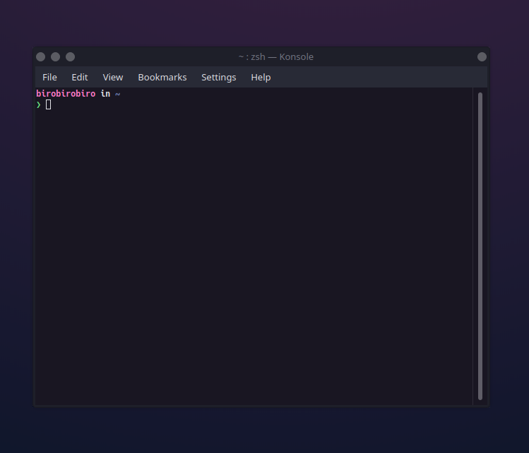

# Omni for [Konsole](https://konsole.kde.org)

> A dark theme for [Konsole](https://konsole.kde.org).

## Install

1.  Copy `Omni.colorscheme` to `~/.local/share/konsole`
2.  Go to _Konsole > Settings > Edit Current Profile… > Appearance_ tab
3.  Select the _Omni_ scheme from the _Color Schemes & Background…_ pane

## Team

This theme is maintained by Rocketseat

 |
--- |
[João Inácio](https://github.com/birobirobiro) |

## License

[MIT License](./LICENSE)